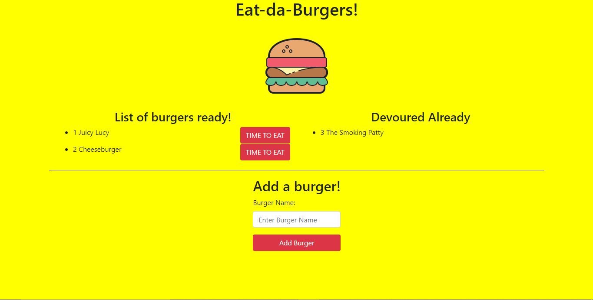

# burger

## Homework Assignment
This is the homework assignment for "Unit 13 Node Express Handlebars". The assignment is to *create a burger logger with MySQL, Node, Express, Handlebars and a homemade ORM (yum!). Follow the MVC design pattern; use Node and MySQL to query and route data in your app, and Handlebars to generate your HTML..*

## Description
This application allows one to decide whether a burger was devoured at the click of a button. The name is stored to MySQL database where any subsequent changes are saved to the DB. If one wants to add a new burger to the website, one just types the name in the input field and click the button. The name of the new burger will be added to the website at the left side where it hasn't been devoured.

In the background, the name is saved to the database with the default "false" value for devoured. Including **devoured**, there is also a **burger_name** and **id** column. I used handlebars to display the website along with Bootstrap CSS for the look. 

Clicking **TIME TO EAT** button leads to the devoured value for that specific burger to change from false to true. It refreshes again and checking that value leads to the burger being sent to the right side (**Devoured Already**). This stays for as long as the database exist.
